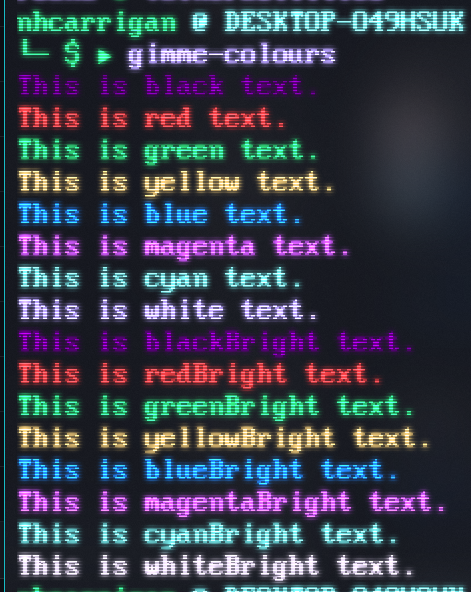

# Gimme Colours

This is a very simple CLI tool which will render the 16 basic colours to your terminal. Helpful for testing your terminal personalisation settings, this tool uses the `chalk` library to generate the colours and display the text.

The colours are in line with the `settings.json` file for Windows Terminal.

## Live Version

This page is currently deployed. [View the live website.](https://npmjs.com/package/gimme-colours)

## Usage

To install the tool, run `npm i -g gimme-colours`. Then run `gimme-colours` to see a colour-coded list of strings.

## Feedback and Bugs

If you have feedback or a bug report, please feel free to open a GitHub issue!

## Contributing

If you would like to contribute to the project, you may create a Pull Request containing your proposed changes and we will review it as soon as we are able! Please review our [contributing guidelines](CONTRIBUTING.md) first.

## Code of Conduct

Before interacting with our community, please read our [Code of Conduct](CODE_OF_CONDUCT.md).

## Licensing

Copyright (C) 2020 Nicholas Carrigan

This program is free software: you can redistribute it and/or modify it under the terms of the GNU Affero General Public License as published by the Free Software Foundation, either version 3 of the License, or (at your option) any later version.

This program is distributed in the hope that it will be useful, but WITHOUT ANY WARRANTY; without even the implied warranty of MERCHANTABILITY or FITNESS FOR A PARTICULAR PURPOSE.  See the GNU Affero General Public License for more details.

The full license terms may be viewed in the [LICENSE.md file](./LICENSE.md)

## Contact

We may be contacted through our [Chat Server](http://chat.nhcarrigan.com) or via [email form](https://contact.nhcarrigan.com).